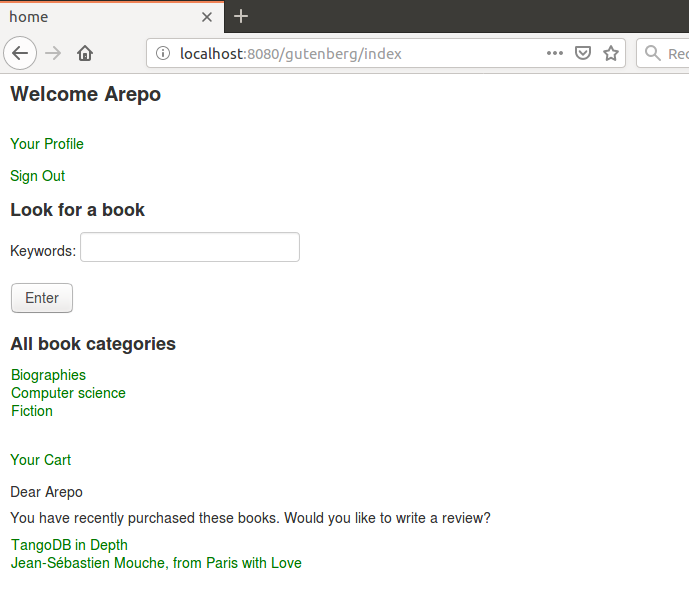
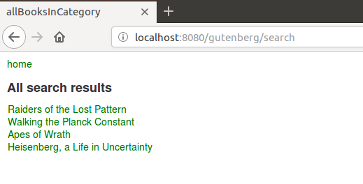
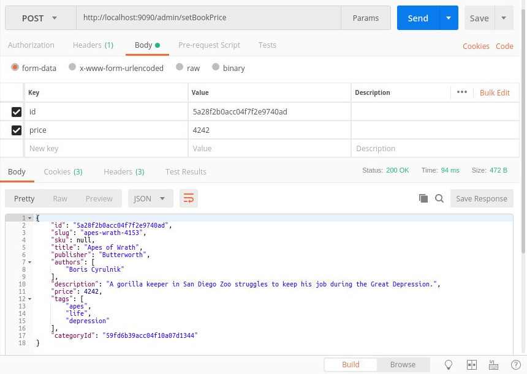
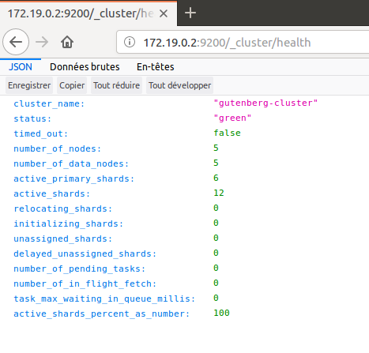
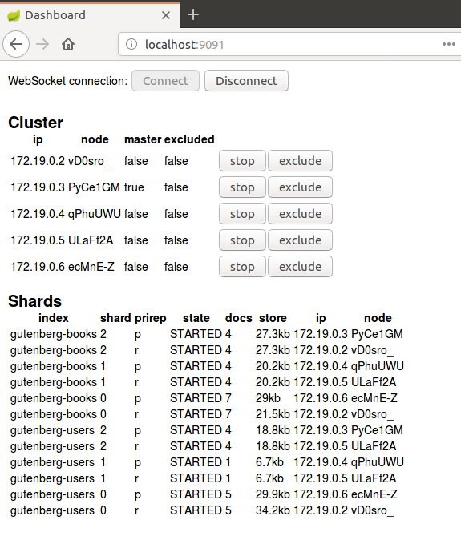
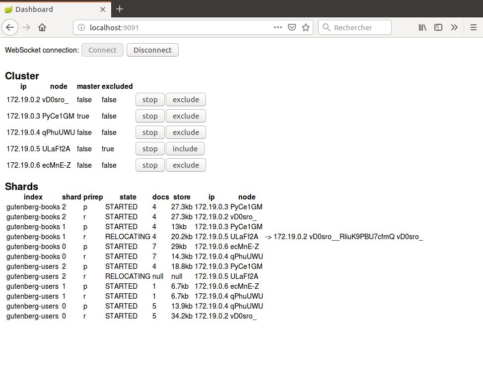
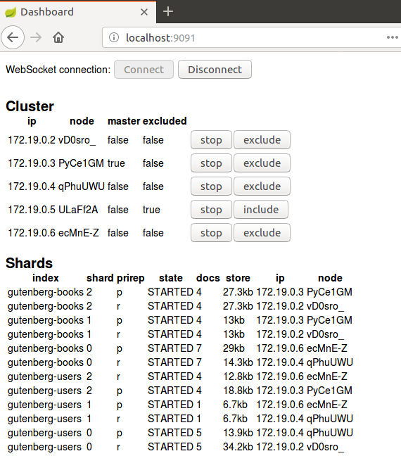
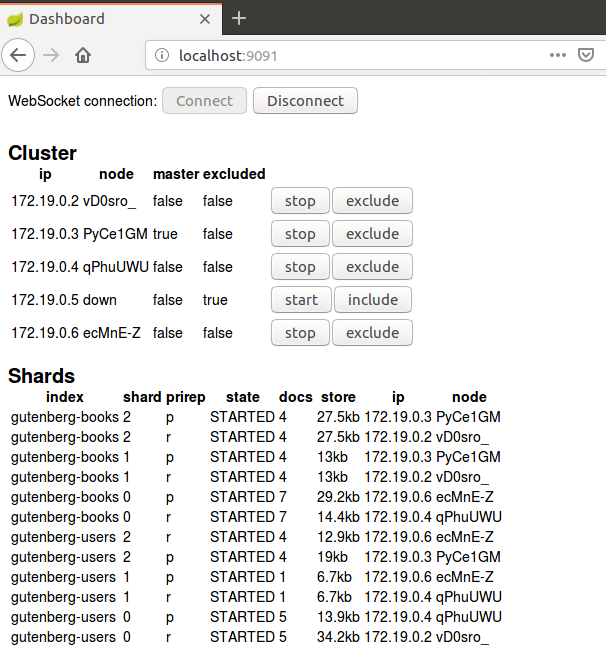
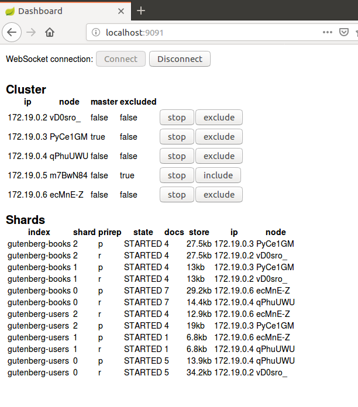
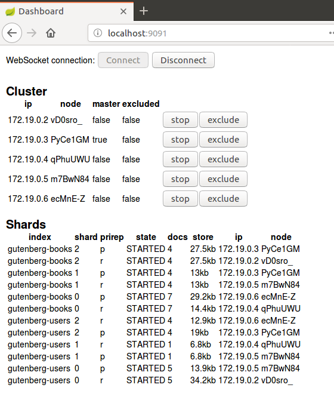

# gutenberg-allegro
I present here a microservice-oriented application that is a Docker version of the previous project [gutenberg-rhapsody](https://github.com/dubersfeld/gutenberg-rhapsody). This project uses an ElasticSearch Docker image instead of the local ElasticSearch service that should be stopped to avoid any port conflict. In addition I present an emulation of an ElasticSearch cluster based on Docker containers.
 
Here are the prerequisites for running the complete application:

A recent Docker version installed (I used 17.12.0-ce)
A recent Apache Maven version installed (I used 3.3.9)
An HTTP tool like Postman or equivalent. 

In addition I used Spring Tool Suite for developing this demo but it is not required for running the application.

# 1 Basic application

Here is the list of all 9 containers:

Server            | Image                                               | Port | Function             | Database connection
---------------   | ----------------------------------------------------| ---- | -------------------  | -------------------
elastic-books     | docker.elastic.co/elasticsearch/elasticsearch:6.6.1 | 9200 | Schemaless database  | 
config-server     | gutenberg/config-server                             | 8888 | Configuration server | None
eurekaserver      | gutenberg/eureka-service                            | 8761 | Discovery server     | None
book-service      | gutenberg/book-server                               | 8081 | Book requests        | gutenberg-books
review-service    | gutenberg/review-server                             | 8082 | Review requests      | gutenberg-reviews
order-service     | gutenberg/order-server                              | 8083 | Order requests       | gutenberg-orders
user-service      | gutenberg/user-server                               | 8084 | User requests        | gutenberg-requests
zuul-service      | gutenberg/zuul-server                               | 5555 | Gateway              | None
frontend-service  | gutenberg/frontend-server                           | 8080 | frontend             | None

A volume is used for persistence.
 
A gateway is used to hide some Spring servers. Here is the list:

Server           | Port | Gateway URI
---------------- | ---- | -------------------------
book-service     | 8081 | zuul-service:5555/books
review-service   | 8082 | zuul-service:5555/reviews
order-service    | 8083 | zuul-service:5555/orders
user-service     | 8084 | zuul-service:5555/users

Here are the steps to run the application:

## 1.1 Images creation

In each of the 10 project subdirectories:

config-server
eureka-service
book-server
review-server
order-server
user-server
zuul-server
frontend-server

run the command: `[sudo] mvn clean package docker:build`

This will create the 8 Spring images. The remaining non Spring image will be pulled from a Docker repository.

## 1.2 Running the application

### 1.2.1 Starting the application
To start the application go to docker subdirectory and run the command:

```
sudo docker-compose up
```

All running Spring containers can be seen on Eureka port 8761.

The frontend itself is accessed on URL localhost:8080/gutenberg. A username and password are required. Here are the prepopulated users:

Username | Password
-------- | --------- 
Carol    | s1a2t3o4r 
Albert   | a5r6e7p8o
Werner   | t4e3n2e1t
Alice    | o8p7e6r5a
Richard  | r1o2t3a4s
Sator    | sator1234 
Arepo    | arepo1234
Tenet    | tenet1234
Opera    | opera1234
Rotas    | rotas1234

### 1.2.2 Populating the ElacsticSearch indices

Once the servers have started go to docker/elasticsearch folder and run the commands:
```
./createBooks.sh
./createUsers.sh
./createReviews.sh
./createOrders.sh
```
It creates all prepopulated indices.

To stop the application run the command in docker subdirectory:

```
sudo docker-compose down
```

Here is a snapshot of the welcome page:



## 1.3 Searching for a book

Enter one or several keywords in the keywords field. Note that gutenberg-books index is searched for matches in three distinct fields: "title", "description", "tags"

Here is a snapshot of the search results for keywords "gorilla quantum pattern captain":



## 1.4 Registering a new user

Click on register on Login page then fill the registration form. The username should not be already present in gutenberg-users  index. Once registered the new user can connect to frontend server.

## 1.5 Using admin-service
To access admin-service the best way is to use Postman or any similar application. The URI is localhost:9090/admin.

Here are two snapshots of Postman interaction:




# 2 Cluster emulation

## 2.1 Network creation

Run this command:
```
sudo docker network create --driver=bridge --subnet=172.19.0.0/16 --gateway=172.19.0.254 gutenberg
```

It creates an external network named gutenberg.

## 2.2 Volumes creation

Create 5 volumes (one for each node) with these commands:
```
sudo docker create volume gutenberg-es-data1
sudo docker create volume gutenberg-es-data2
sudo docker create volume gutenberg-es-data3
sudo docker create volume gutenberg-es-data4
sudo docker create volume gutenberg-es-data5
```

## 2.3 Cluster creation
To start the cluster emulation go to the cluster directory and run the command:

```
sudo docker-compose up 
``` 

It starts a 5 nodes ElasticSearch cluster with fixed IPs:

```
172.19.0.2,172.19.0.3,172.19.0.4,172.19.0.5,172.19.0.6
```

Once the cluster has started go to the folder cluster/elasticsearch and run the shells createBooks.sh and createUsers.sh. Check the cluster on the IP:

```
http://172.19.0.2/_cluster/health
```

The response should look like this screen shot:





Go to the project cluster-monitor and run the command:

```
mvn spring-boot:run
```

Then hit localhost:9091 in a browser and click connect button. The response should look like this screen shot:



Click the exclude button on any node and see the shards relocate. The display should look like this screen shot:




Click the stop button on the same node and wait for the node to stop. The display should look like this screen shot:



Start the stopped node again and when it is up click the include button. The shards should relocate one more time.






Note that if the master node is stopped a new master is elected. The election process can take a significant time.

