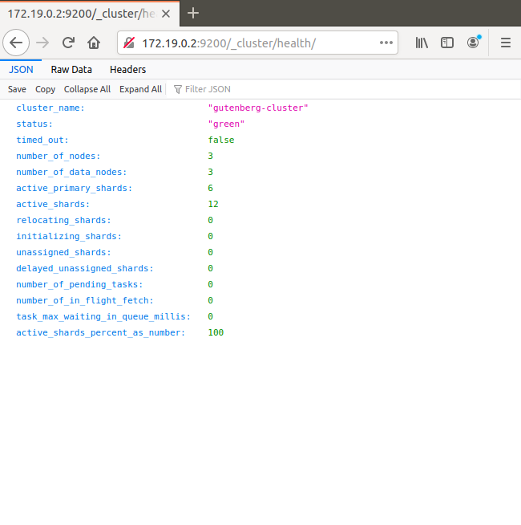
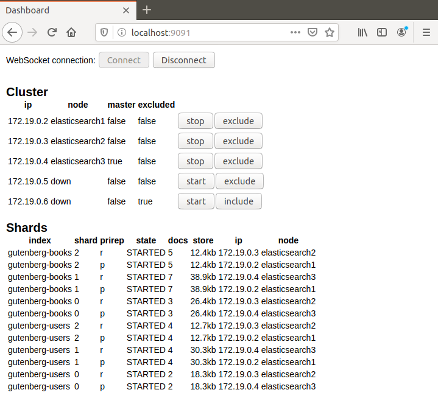

# gutenberg-allegro
I present here a microservice-oriented application that is a Docker version of the previous project [gutenberg-rhapsody](https://github.com/dubersfeld/gutenberg-rhapsody). This project uses an ElasticSearch Docker image instead of the local ElasticSearch service that should be stopped to avoid any port conflict. In addition I present an emulation of an ElasticSearch cluster based on Docker containers.
 
Here are the prerequisites for running the complete application:

A recent Docker version installed (I used 19.03.11-ce)
A recent Apache Maven version installed (I used 3.6.0)
An HTTP tool like Postman or equivalent.
I took advantage of the new native Docker support provided by Spring Boot 2.3.
  
In addition I used Spring Tool Suite for developing this demo but it is not required for running the application.

# 1 Basic application

Here is the list of all 9 containers:

Server            | Image                                               | Port | Function             | Database connection
---------------   | ----------------------------------------------------| ---- | -------------------  | -------------------
elastic-books     | docker.elastic.co/elasticsearch/elasticsearch:6.6.1 | 9200 | Schemaless database  | 
config-server     | gutenberg/config-server                             | 8888 | Configuration server | None
eurekaserver      | gutenberg/eureka-server                             | 8761 | Discovery server     | None
book-service      | gutenberg/book-server                               | 8081 | Book requests        | gutenberg-books
review-service    | gutenberg/review-server                             | 8082 | Review requests      | gutenberg-reviews
order-service     | gutenberg/order-server                              | 8083 | Order requests       | gutenberg-orders
user-service      | gutenberg/user-server                               | 8084 | User requests        | gutenberg-requests
gateway-service   | gutenberg/gateway-server                            | 5555 | Gateway              | None
frontend-service  | gutenberg/frontend-server                           | 8080 | frontend             | None

A volume is used for persistence.
 
A gateway is used to hide some Spring servers. Here is the list:

Server           | Port | Gateway URI
---------------- | ---- | -------------------------
book-service     | 8081 | gateway-service:5555/books
review-service   | 8082 | gateway-service:5555/reviews
order-service    | 8083 | gateway-service:5555/orders
user-service     | 8084 | gateway-service:5555/users

Here are the steps to run the application:

## 1.1 Images creation

Run the bash script build_spring.

```
#!/bin/bash
# filename buildSpring

for server in 'book-server' 'config-server' 'order-server' 'review-server' 'user-server' 'eureka-server' 'gateway-server' 'frontend-server';
do 
    echo ${server}
    cd ../$server
    pwd
    ./build.sh

    echo $?
    if [ "$?" -ne 0 ]
    then 
      echo "Build failed for $server"
      exit "$?"
    fi
done
```

Then run the bash script buildSecond:

```
#!/bin/bash
#buildSecond

for f in 'book' 'config' 'frontend' 'gateway' 'order' 'review' 'user' 'eureka';
do 
   echo ${f}
   cd $f
   pwd
   ./build.sh
   cd ..

   echo $?
   if [ "$?" -ne 0 ]
   then 
      echo "Build failed for $f"
      exit "$?"
   fi
done;
``` 

This creates the 8 Spring images. The remaining non Spring image will be pulled from a Docker repository.

## 1.2 Running the application

### 1.2.1 Adding user to Docker group

To avoid using sudo run this command:

sudo usermod -aG docker $USER

### 1.2.1 Volume creation

To create the volume used for persistence run the command: `docker volume create gutenberg-es-data`

### 1.2.3 Starting the application
To start the application go to docker subdirectory and run the command:

```
docker-compose up
```

All running Spring containers can be seen on Eureka port 8761.

The frontend itself is accessed on URL localhost:8080/gutenberg. A username and password are required. Here are the prepopulated users:

Username | Password
-------- | --------- 
Carol    | s1a2t3o4r 
Albert   | a5r6e7p8o
Werner   | t4e3n2e1t
Alice    | o8p7e6r5a
Richard  | r1o2t3a4s
Sator    | sator1234 
Arepo    | arepo1234
Tenet    | tenet1234
Opera    | opera1234
Rotas    | rotas1234

### 1.2.2 Populating the ElacsticSearch indices

Once the servers have started go to docker/elasticsearch folder and run the commands:
```
./createBooks.sh
./createCategories.sh
./createUsers.sh
./createReviews.sh
./createOrders.sh
```
It creates all prepopulated indices.

To stop the application run the command in docker subdirectory:

```
docker-compose down
```

Here is a snapshot of the welcome page:


## 1.3 Searching for a book

Enter one or several keywords in the keywords field. Note that gutenberg-books index is searched for matches in three distinct fields: "title", "description", "tags"

Here is a snapshot of the search results for keywords "gorilla quantum pattern captain":


## 1.4 Registering a new user

Click on register on Login page then fill the registration form. The username should not be already present in gutenberg-users  index. Once registered the new user can connect to frontend server.

## 1.5 Using admin-service
To access admin-service the best way is to use Postman or any similar application. The URI is localhost:9090/admin. To start admin-server go in subdirectory admin-server and run the command `mvn spring-boot-run`. 

Here are two snapshots of Postman interaction:


## 1.6 Running as as service

Here I assume that systemd is installed. It is native from RedHat distros but also available on Ubuntu since Ubuntu 16.04

### 1.6.1 Creating a systemd file

In systemd configuration directory (In Ubuntu it is /etc/systemd/system) add a systemd file name gutenberg.service:

```
# filename gutenberg.service
[Unit]
Description=Simple Docker ElasticsSearch Application
After=network.target
After=docker.service
Requires=docker.service

[Service]
User=ubersfeld # edit to match your own username
# edit to match your own filesystem
ExecStart=/bin/bash -c 'cd ~/Documents/gutenberg-allegro/docker ; ./start.sh'
ExecStop=/bin/bash -c 'cd ~/Documents/gutenberg-allegro/docker ; ./stop.sh'

[Install]
WantedBy=multi-user.target
```

To start gutenberg as a service run this command:

```
systemctl start gutenberg
```

To check the status run this command: `systemctl status gutenberg`. The response should look like:

```
● gutenberg.service - Simple Docker ElasticsSearch Application
   Loaded: loaded (/etc/systemd/system/gutenberg.service; disabled; vendor preset: enabled)
   Active: active (running) since Tue 2020-06-23 09:42:29 CEST; 4s ago
 Main PID: 9708 (bash)
    Tasks: 22 (limit: 4915)
   CGroup: /system.slice/gutenberg.service
           ├─9708 /bin/bash -c cd ~/Documents/workspace-allegro-clean/docker ; ./start.sh
           ├─9709 /bin/bash -c cd ~/Documents/workspace-allegro-clean/docker ; ./start.sh
           ├─9710 docker-compose up
           └─9718 docker-compose up

juin 23 09:42:29 dominique-Inspiron-3671 systemd[1]: Started Simple Docker ElasticsSearch Application.
juin 23 09:42:30 dominique-Inspiron-3671 bash[9708]: Creating docker_gateway-service_1 ...
juin 23 09:42:30 dominique-Inspiron-3671 bash[9708]: Creating elastic-books            ...
juin 23 09:42:30 dominique-Inspiron-3671 bash[9708]: Creating docker_eurekaserver_1    ...
juin 23 09:42:30 dominique-Inspiron-3671 bash[9708]: Creating docker_frontend-server_1 ...
juin 23 09:42:30 dominique-Inspiron-3671 bash[9708]: Creating docker_book-service_1    ...
juin 23 09:42:30 dominique-Inspiron-3671 bash[9708]: Creating docker_user-service_1    ...
juin 23 09:42:30 dominique-Inspiron-3671 bash[9708]: Creating docker_config-server_1   ...
juin 23 09:42:30 dominique-Inspiron-3671 bash[9708]: Creating docker_review-service_1  ...
juin 23 09:42:30 dominique-Inspiron-3671 bash[9708]: Creating docker_order-service_1   ...
```

Then populate the indices like in 1.2.2

To stop the service run the command:
```
systemctl stop gutenberg
```

To enable the service to start on boot up run this command:
```
systemctl enable gutenberg
```

To disable the service to start on boot up run this command:
```
systemctl disable gutenberg
```

# 2 Cluster emulation

## 2.1 Network creation

Run this command:
```
docker network create --driver=bridge --subnet=172.19.0.0/16 --gateway=172.19.0.254 gutenberg
```

It creates an external network named gutenberg.

## 2.2 Volumes creation

Create 5 volumes (one for each node) with these commands:
```
docker volume create gutenberg-es-data1
docker volume create gutenberg-es-data2
docker volume create gutenberg-es-data3
docker volume create gutenberg-es-data4
docker volume create gutenberg-es-data5
```

## 2.3 Cluster creation
To start the cluster emulation go to the cluster directory and run the command:

```
./start.sh 
``` 

Here I chose to use a bash script because docker-compose does not behave as expected with the new version 7.7.x of Elasticsearch (master discovery fails).

```
#!/bin/bash

# filename start.sh

NAME=elasticsearch1
IP=172.19.0.2
VOLUME=elasticsearch1

echo "NAME $NAME"
echo "IP $IP"
echo "VOLUME $VOLUME"
echo "Restarting node"

docker run -e "cluster.name=gutenberg-cluster" -e "bootstrap.memory_lock=true" \
--name $NAME \
--ip $IP \
-e "discovery.seed_hosts=172.19.0.2,172.19.0.3,172.19.0.4,172.19.0.5,172.19.0.6" \
--ulimit memlock=-1:-1 \
--volume "$VOLUME:/usr/share/elasticsearch/data" \
--network gutenberg docker.elastic.co/elasticsearch/elasticsearch:7.7.1 &
disown

NAME=elasticsearch2
IP=172.19.0.3
VOLUME=elasticsearch2

echo "NAME $NAME"
echo "IP $IP"
echo "VOLUME $VOLUME"
echo "Restarting node"

docker run -e "cluster.name=gutenberg-cluster" -e "bootstrap.memory_lock=true" \
--name $NAME \
--ip $IP \
-e "discovery.seed_hosts=172.19.0.2,172.19.0.3,172.19.0.4,172.19.0.5,172.19.0.6" \
--ulimit memlock=-1:-1 \
--volume "$VOLUME:/usr/share/elasticsearch/data" \
--network gutenberg docker.elastic.co/elasticsearch/elasticsearch:7.7.1 &
disown

NAME=elasticsearch3
IP=172.19.0.4
VOLUME=elasticsearch3

echo "NAME $NAME"
echo "IP $IP"
echo "VOLUME $VOLUME"
echo "Restarting node"

docker run -e "cluster.name=gutenberg-cluster" -e "bootstrap.memory_lock=true" \
--name $NAME \
--ip $IP \
-e "discovery.seed_hosts=172.19.0.2,172.19.0.3,172.19.0.4,172.19.0.5,172.19.0.6" \
--ulimit memlock=-1:-1 \
--volume "$VOLUME:/usr/share/elasticsearch/data" \
--network gutenberg docker.elastic.co/elasticsearch/elasticsearch:7.7.1 &
disown
``` 

It starts a 3 nodes ElasticSearch cluster with fixed IPs:

```
172.19.0.2,172.19.0.3,172.19.0.4,172.19.0.5,172.19.0.6
```

Once the cluster has started go to the folder cluster/elasticsearch and run the shells createBooks.sh and createUsers.sh. Check the cluster on the IP:

```
http://172.19.0.2:9200/_cluster/health
```

The response should look like this screen shot:





Go to the project cluster-monitor and run the command:

```
mvn spring-boot:run
```

Then hit localhost:9091 in a browser and click connect button. The response should look like this screen shot:


Click the exclude button on any non master node and see the shards relocate. The display should look like this screen shot:


Click the stop button on the same node and wait for the node to stop. The display should look like this screen shot:


Start the stopped node again and when it is up click the include button. The shards should relocate one more time.




Note that if the master node is stopped a new master is elected. The election process can take a significant time.

To stop the cluster run the command:
```
./stop.sh
```

For a video demo follow this link:

https://youtu.be/HSfKYiql7zg


Cachan, June 25 2020 


